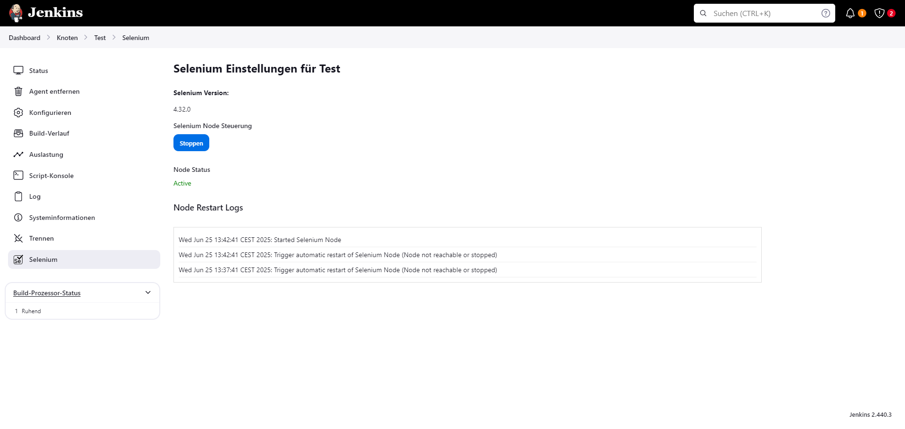

# Selenium Plugin for Jenkins

A Jenkins plugin that integrates Selenium Grid directly into your Jenkins environment. It allows you to easily configure and run Selenium Hub and Nodes on your Jenkins Agents.

## Features

- **Selenium Hub Management**: Start and stop the Selenium Hub directly from the Jenkins UI
- **Selenium Node Management**: Configure and manage Selenium Nodes on your Jenkins agents
- **Version Selection**: Choose the Selenium version to use from available releases
- **Health Checks**: Automatic health monitoring and restart of failed nodes
- **Grid Status**: View the status of the Selenium Grid including registered nodes and available slots

## Configuration

1. Navigate to **Manage Jenkins** > **Selenium Settings**
2. Select a Selenium version from the dropdown
3. Click **Save** to apply the configuration
4. Start the Selenium Hub using the **Start Hub** button

## Agent Configuration

Each Jenkins agent can run a Selenium Node. To configure:

1. Navigate to the agent's page
2. Click on **Selenium** in the sidebar
3. Use the toggle to enable/disable the Selenium Node on this agent

## Screenshots

## Contributing

See [CONTRIBUTING.md](CONTRIBUTING.md) for development setup and contribution guidelines.

## License

Licensed under the Apache License, Version 2.0. See [LICENSE](LICENSE) for details.

